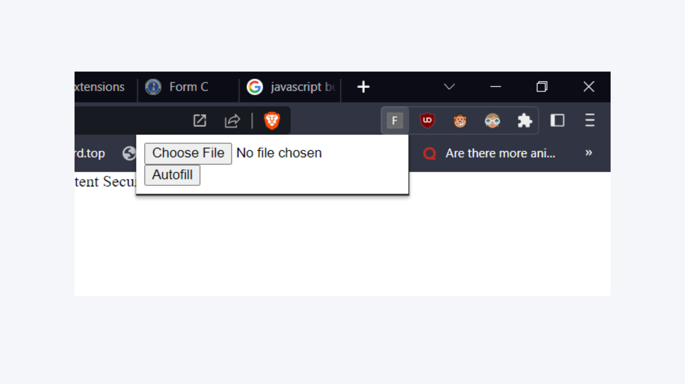

# FORM-C Autofiller

## Overview

This project is a Chrome extension developed from February 2023 to April 2023. It automates the completion of the FRRO (Foreigners Regional Registration Officer) C form, significantly reducing form-filling time.

### Key Features
- **Automated Form Filling**: Reduced form-filling time by 80%.
- **OCR Integration**: Utilized Optical Character Recognition to scan and extract MRZ codes from passports.
- **Extension Development**: Built using JavaScript and HTML/CSS.
- **User Experience Enhancement**: Streamlined the process, reducing manual data entry errors by 90%.

## Screenshots

### Extension in Action

### MRZ Code Scanning

## Technologies Used

- **JavaScript**
- **HTML/CSS**
- **OCR Technology**

## Project Details

- **Duration**: February 2023 – April 2023
- **Roles**: Extension Development, OCR Integration

