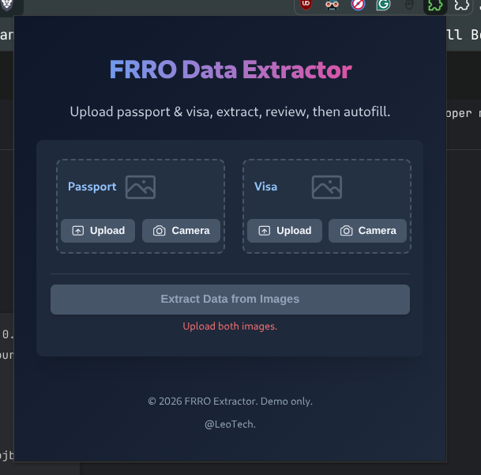
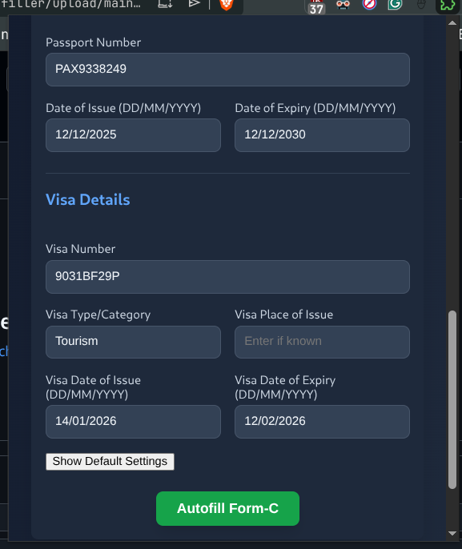

# FORM-C Autofiller

## Overview

Backend for our SaaS platform and browser extension

**Core Components**

- **Django Ninja** for async APIs
- **PostgreSQL** for relational data
- **AWS S3** for image storage (upload via pre-signed URL)
- **Async OCR** with **Gemini API**

- **Payment Gateway:** Razorpay (server-side)

## Screenshots

### Extension in Action

## Project Details

- **Duration**: ongoing

